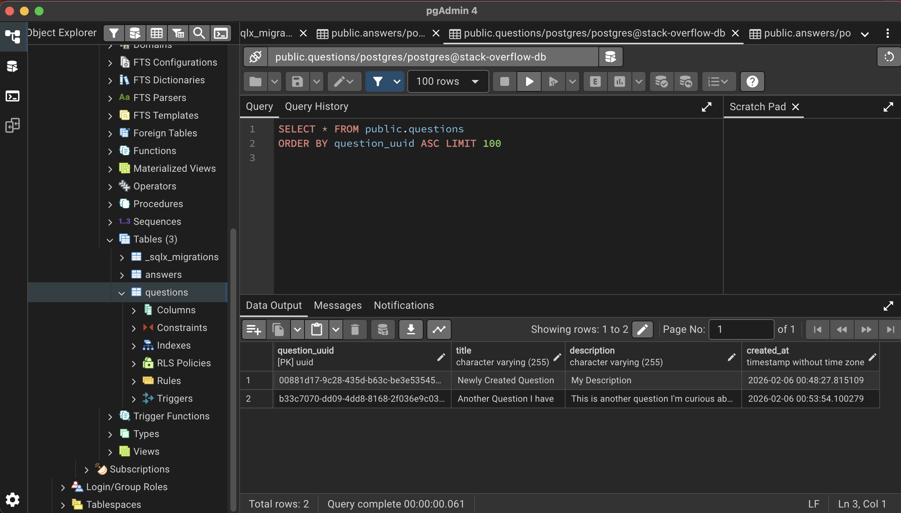
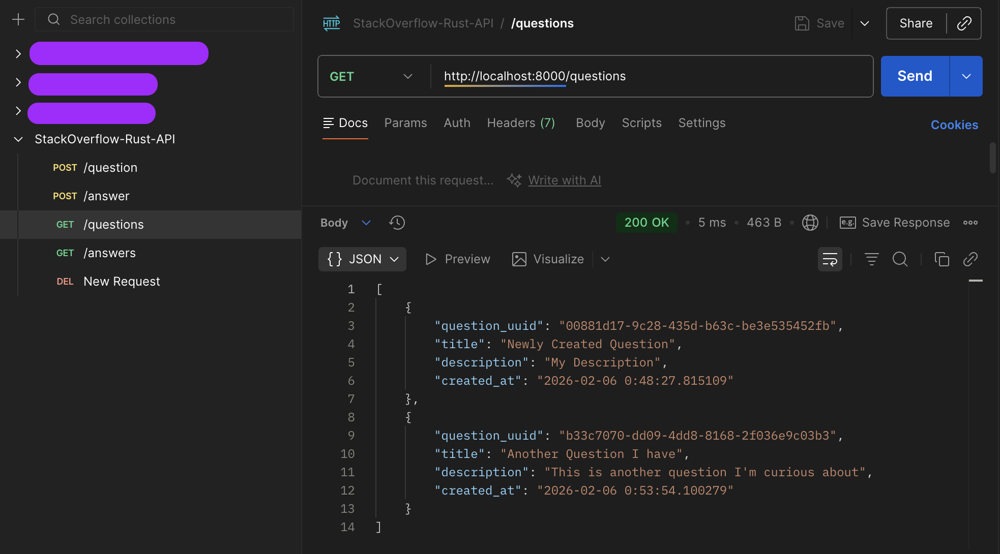
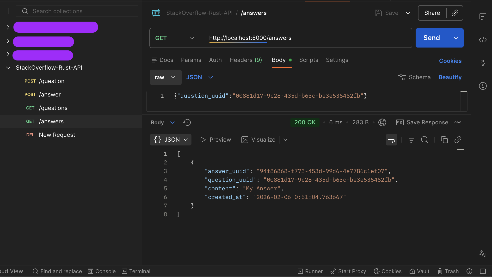

### Stack Overflow Clone API in Rust
This is a simple RESTful API for a Stack Overflow clone built using Rust, Axum, and PostgreSQL.

### pgAdmin 4 -- Questions Table


### Postman -- Get Questions & Answers



### Start Rust Server
```bash
# cargo watch // automatically restart server when source files change
$ cargo watch -q -c -w src/ -x run
```

#### Create a Question (POST)
```bash
curl -X POST http://localhost:8000/question \
  -H 'Content-Type: application/json' \
  -d '{"title":"Newly Created Question","description":"My Description"}'

>>
[
  {
    "question_uuid": "00881d17-9c28-435d-b63c-be3e535452fb",
    "title": "Newly Created Question",
    "description": "My Description",
    "created_at": "2026-02-06 0:48:27.815109"
  }
]
```

#### Get Questions (GET)
```bash
curl http://localhost:8000/questions
```

#### Delete a Question (DELETE)
```bash
curl -X DELETE http://localhost:8000/question \
  -H 'Content-Type: application/json' \
  -d '{"question_uuid":"<QUESTION_UUID>"}'
```

#### Create an Answer (POST)
```bash
curl -X POST http://localhost:8000/answer \
  -H 'Content-Type: application/json' \
  -d '{"question_uuid":"<QUESTION_UUID>","content":"My Answer"}'
```

#### Get Answers for a Question (GET)
```bash
curl http://localhost:8000/answers \
  -H 'Content-Type: application/json' \
  -d '{"question_uuid":"<QUESTION_UUID>"}'
```

#### Delete an Answer (DELETE)
```bash
curl -X DELETE http://localhost:8000/answer \
  -H 'Content-Type: application/json' \
  -d '{"answer_uuid":"<ANSWER_UUID>"}'
```

### Kill hanging PID
```bash
$ lsof -nP -iTCP:8000 -sTCP:LISTEN
$ kill -9 <PID>
```

### Start PostgreSQL Database
```bash
$ docker run --name stack-overflow-db -e POSTGRES_PASSWORD=xxxxxx -p 55008:5432 -d postgres
```

### Run Database Migrations
```bash
$ sqlx migrate run
```